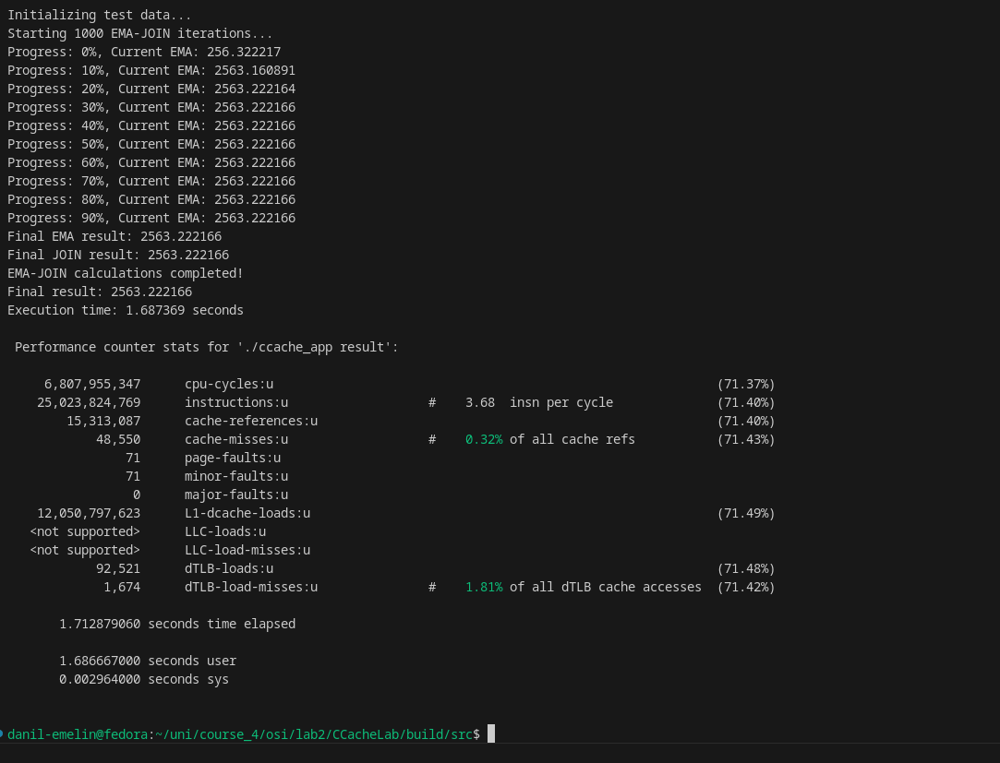
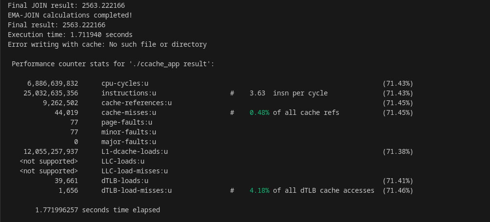

## Операционные системы
# Лабораторная работа №2

### Setup
```
meson setup build
```

### Compile
```
meson compile -C build
```

Реализация `page cache` с политикой `MRU` (Most recent used). Проверка библиотеки осущетвляется с помощью нагрузчика `ema-join` - join элементов с одинаковым id

## Сравнение времени нагрузки

### Выполнение тестовой программы с кэшом

```
perf stat -e cpu-cycles,instructions,cache-references,cache-misses,page-faults,minor-faults,major-faults,L1-dcache-loads,LLC-loads,LLC-load-misses,dTLB-loads,dTLB-load-misses ./ccache_app result
```




Высокая вычислительная эффективность - программа демонстрирует отличный показатель IPC 3.68, что близко к теоретическому максимуму процессора, свидетельствуя об эффективном использовании конвейера и хорошей векторизации кода<br>

Исключительная работа с памятью - чрезвычайно низкий процент промахов кэша (0.32%) и отсутствие обращений к диску (major faults = 0) показывают превосходную локальность данных и оптимальное использование кэш-памяти процессора.<br>

Минимальные системные накладные расходы - 98.5% времени выполнения приходится на пользовательский режим при практически нулевом системном времени, что характеризует программу как чисто CPU-bound приложение без bottlenecks в подсистеме ввода-вывода.<br>

### Выполнение тестовой программы без кэша
```
perf stat -e cpu-cycles,instructions,cache-references,cache-misses,page-faults,minor-faults,major-faults,L1-dcache-loads,LLC-loads,LLC-load-misses,dTLB-loads,dTLB-load-misses ./ccache_app result
```



Снижение производительности - время выполнения увеличилось с 1.713 до 1.772 секунд (+3.4%), а IPC уменьшился с 3.68 до 3.63

Ухудшение эффективности доступа к памяти - процент промахов TLB вырос с 1.81% до 4.18%, а количество обращений к TLB сократилось более чем в 2 раза, что свидетельствует о менее оптимальных паттернах доступа к памяти.